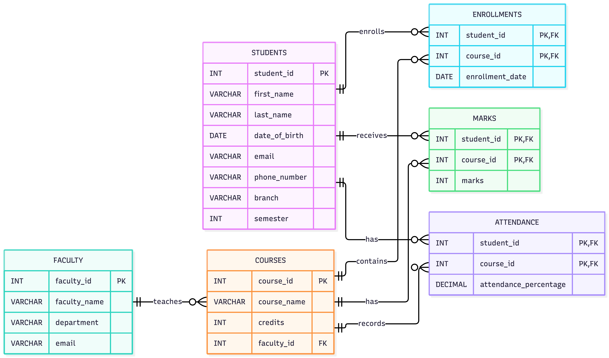

# Student Academic Management System

A MySQL-based database project designed to manage student academic information, including students, courses, faculty, enrollments, marks, and attendance.

The project demonstrates practical SQL and DBMS concepts such as table relationships, joins, views, subqueries, stored procedures, triggers, window functions, and transactions.

## Features

- Manage student and faculty information
- Manage courses and faculty assignments
- Track student course enrollments
- Store and analyze student marks
- Track attendance percentages
- Generate academic reports using SQL views
- Generate individual student reports using stored procedures
- Validate marks and attendance using triggers
- Prevent deletion of students with existing enrollments
- Perform student performance analysis and ranking
- Demonstrate transaction management using COMMIT and ROLLBACK

## Database Design

The system uses six main relational tables:

| Table | Purpose |
|---|---|
| `Students` | Stores student personal and academic information |
| `Faculty` | Stores faculty details |
| `Courses` | Stores course information and assigned faculty |
| `Enrollments` | Connects students with the courses they take |
| `Marks` | Stores marks obtained by students in each course |
| `Attendance` | Stores attendance percentage for each student in each course |

### Key Relationships

- One faculty member can teach multiple courses.
- One student can enroll in multiple courses.
- One course can have multiple students.
- The many-to-many relationship between students and courses is handled through the `Enrollments` junction table.
- `Marks` and `Attendance` are associated with both students and courses.
- `student_id` and `course_id` form composite primary keys in `Enrollments`, `Marks`, and `Attendance`.

## Technologies Used

- **MySQL** — Relational database management system
- **SQL** — Database creation, querying, reporting, and data manipulation
- **VS Code** — SQL script development and project organization
- **Mermaid** — ER diagram visualization

## SQL Concepts Demonstrated

The project demonstrates the following DBMS and SQL concepts:

- **DDL (Data Definition Language)** — Creating databases and tables
- **DML (Data Manipulation Language)** — Inserting and updating records
- **Primary and Foreign Keys** — Maintaining relationships between tables
- **Composite Primary Keys** — Used in `Enrollments`, `Marks`, and `Attendance`
- **JOINs** — Combining data from multiple related tables
- **Aggregate Functions** — `COUNT()`, `AVG()`, and `MAX()`
- **GROUP BY and ORDER BY** — Grouping and sorting analytical results
- **Subqueries** — Finding above-average students and highest scores
- **CASE Expressions** — Categorizing student performance
- **Views** — Creating reusable academic reports
- **Window Functions** — Ranking students using `RANK()`
- **Stored Procedures** — Generating reports for individual students
- **Triggers** — Validating marks and attendance and protecting data integrity
- **Transactions** — Managing multiple changes using `START TRANSACTION`, `COMMIT`, and `ROLLBACK`

## ER Diagram

The following ER diagram represents the database structure and relationships between students, faculty, courses, enrollments, marks, and attendance.

